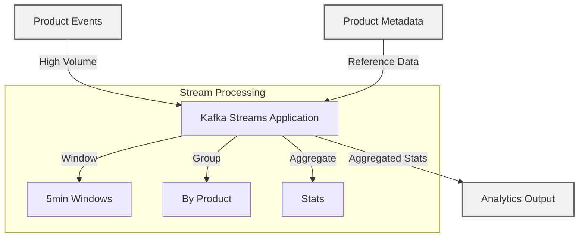
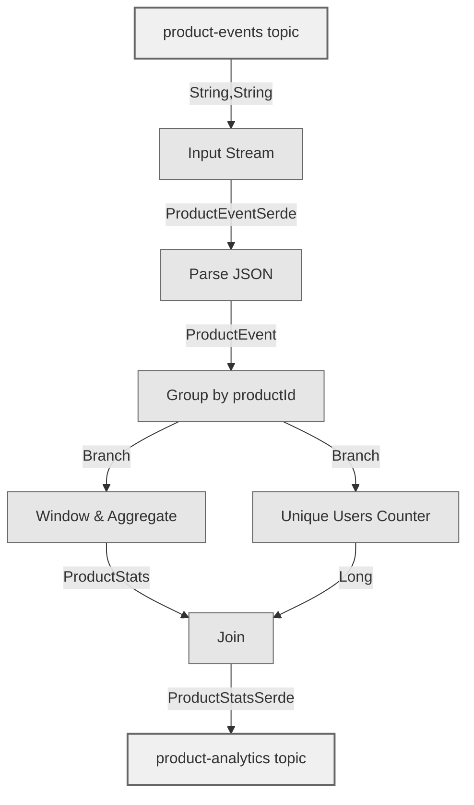
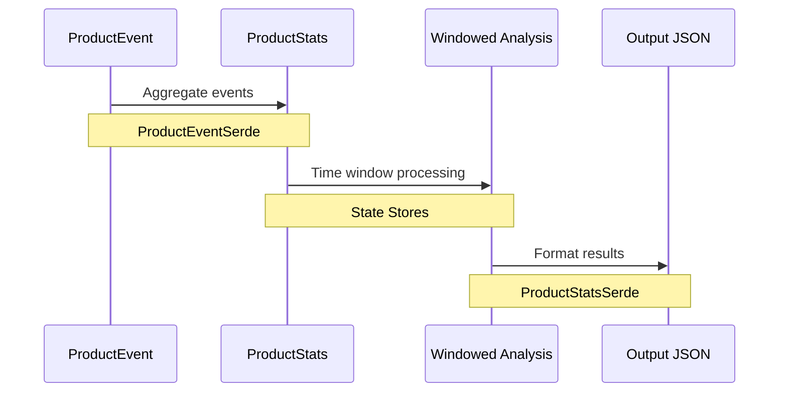
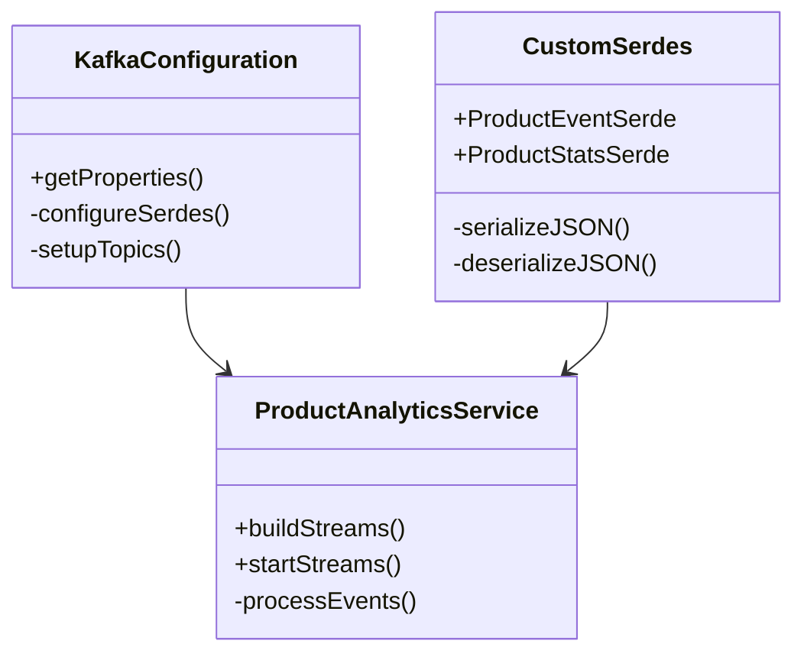

# Real-Time Product Analytics with Kafka Streams

This project demonstrates how to build a real-time product analytics platform using Kafka Streams, solving common challenges in e-commerce analytics at scale.

## Business Problem

Modern e-commerce platforms face several challenges when analyzing product performance:

1. **High Volume Data Processing**: Millions of user interactions (views, clicks, purchases) per minute
2. **Real-Time Insights**: Need immediate visibility into product performance
3. **Complex Metrics**: Tracking unique users, conversion rates, and time-based trends
4. **Data Consistency**: Maintaining accurate statistics across distributed systems
5. **Resource Efficiency**: Processing analytics without impacting the main application

## Solution Architecture

We solve these challenges using Kafka Streams to process three key data streams:

1. **Product Events** (`product-events` topic)
   - User interactions with products (views, clicks, purchases)
   - High volume, real-time events
   - Contains: productId, userId, eventType, timestamp, value

2. **Product Metadata** (`product-metadata` topic)
   - Product details (name, category, price)
   - Lower volume, updated periodically
   - Contains: productId, name, category, basePrice

3. **Analytics Output** (`product-analytics` topic)
   - Aggregated statistics and insights
   - Time-windowed analysis
   - Contains: productId, viewCount, uniqueUsers, totalValue, conversionRate

### Topic Schemas and Data Flow

Here's how the data flows through the system, from input topics to output:

#### 1. Product Events Topic (`product-events`)
```json
{
    "productId": "P123",
    "userId": "U789",
    "eventType": "VIEW",
    "timestamp": 1648656000000,
    "value": 199.99
}
```

#### 2. Product Metadata Topic (`product-metadata`)
```json
{
    "productId": "P123",
    "name": "Premium Headphones",
    "category": "Electronics",
    "basePrice": 199.99
}
```

#### 3. Analytics Output Topic (`product-analytics`)
The output combines event aggregations with product metadata:
```json
{
    // From product-metadata
    "productId": "P123",
    "name": "Premium Headphones",
    "category": "Electronics",
    "basePrice": 199.99,
    
    // Aggregated from product-events
    "viewCount": 145,
    "uniqueUsers": 89,
    "totalValue": 1799.91,
    "conversionRate": 0.12,
    
    // Time window information
    "windowStart": 1648656000000,
    "windowEnd": 1648656300000
}
```

#### Data Transformation Process
1. Events are grouped by `productId` and aggregated in 5-minute windows
2. Unique users are counted using the `userId` field
3. Total value is summed from the `value` field
4. Conversion rate is calculated as `uniqueUsers / viewCount`
5. Product metadata is joined using the `productId` as the key
6. Results are continuously updated as new events arrive



### Why Kafka Streams?

1. **Scalability**
   - Horizontal scaling with partition distribution
   - Stateful processing with fault tolerance
   - Handles millions of events per second

2. **Real-Time Processing**
   - Sub-second latency for analytics
   - Time-windowed aggregations
   - Immediate insights for business decisions

3. **Fault Tolerance**
   - Automatic recovery from failures
   - Exactly-once processing semantics
   - Built-in state store backups

4. **Resource Efficiency**
   - No separate processing cluster needed
   - Runs alongside your application
   - Efficient state management

### Performance Characteristics

- **Throughput**: 100k+ events/second per node
- **Latency**: < 100ms end-to-end processing
- **Recovery Time**: < 30 seconds after node failure
- **State Management**: Local state stores with changelog topics
- **Memory Usage**: Configurable with cache settings

## Features
- Real-time product event processing
- Time-windowed analytics
- Unique user tracking
- Aggregated product statistics
- State store management

## Example Projects

### 1. Java Streams Demo (`examples/java-streams`)
This example demonstrates efficient data processing using pure Java Streams API (without Kafka). It provides a great comparison between traditional Java Streams processing and Kafka Streams:

**Key Differences from Main Project:**
- In-memory processing vs. distributed streaming
- Single JVM vs. scalable cluster
- Batch processing vs. continuous streaming
- Local state vs. distributed state stores

**Features:**
- Parallel stream processing
- Memory-efficient data handling
- Complex aggregations and transformations
- Performance benchmarking with various dataset sizes

To run the Java Streams demo:
```bash
cd examples/java-streams
./gradlew run
```

See the [Java Streams Demo README](examples/java-streams/Readme.md) for detailed information.

## Prerequisites
- Java 17+
- Docker and Docker Compose
- Gradle

## Setup Instructions

### 1. Start Kafka Environment
```bash
# Start Kafka and related services
docker-compose up -d

# Wait for about 30 seconds for all services to be ready
```

The following topics are automatically created with 4 partitions and replication factor 1:
- `product-events`: Captures user interactions with products
- `product-metadata`: Stores product details and information
- `product-analytics`: Contains aggregated analytics results

You can verify the topics are created using:
```bash
# List all topics
docker exec broker kafka-topics --list --bootstrap-server localhost:9092

# View topic details
docker exec broker kafka-topics --describe --bootstrap-server localhost:9092 --topic product-events
docker exec broker kafka-topics --describe --bootstrap-server localhost:9092 --topic product-metadata
docker exec broker kafka-topics --describe --bootstrap-server localhost:9092 --topic product-analytics
```

### 2. Run the Application
```bash
# Build and run the application
./gradlew bootRun
```

## Testing the Setup

### 1. Load Product Metadata
```bash
# Load sample product metadata
./gradlew loadProductMetadata
```

Example metadata record:
```json
{
  "productId": "P123",
  "name": "Premium Headphones",
  "category": "Electronics",
  "basePrice": 199.99
}
```

### 2. Generate Product Events
```bash
# Run the test data producer (in a separate terminal)
./gradlew generateTestData
```

Example event:
```json
{
  "productId": "P123",
  "userId": "U789",
  "eventType": "VIEW",
  "timestamp": 1648656000000,
  "value": 199.99
}
```

### 3. Monitor Analytics Output
```bash
# View the analytics output
docker exec -it broker kafka-console-consumer \
    --bootstrap-server localhost:9092 \
    --topic product-analytics \
    --from-beginning
```

Example analytics output:
```json
{
  "productId": "P123",
  "name": "Premium Headphones",
  "category": "Electronics",
  "viewCount": 145,
  "uniqueUsers": 89,
  "totalValue": 1799.91,
  "conversionRate": 0.12,
  "windowStart": 1648656000000,
  "windowEnd": 1648656300000
}
```

### 4. Performance Testing
```bash
# Run high-volume test (100k events/second)
./gradlew generateLoadTest

# Monitor metrics
open http://localhost:9021  # Confluent Control Center
```

## Project Structure
```
src/main/java/kafkastreams/
├── KafkaStreamsDemoApplication.java  # Main application
├── KafkaStreamsConfiguration.java    # Kafka configuration
├── ProductAnalyticsService.java      # Stream processing logic
├── serdes/
│   ├── ProductEventSerde.java       # Serializer/Deserializer for ProductEvent
│   └── ProductStatsSerde.java       # Serializer/Deserializer for ProductStats
└── models/
    ├── ProductEvent.java            # Event data model
    └── ProductStats.java            # Analytics data model
```

## Key Components

### Visual Architecture

#### Processing Pipeline


#### Data Flow


#### Component Architecture


### ProductEvent
- Represents individual product events
- Contains: productId, userId, eventType, timestamp, value

### ProductStats
- Aggregated statistics for products
- Contains: productId, viewCount, uniqueUsers, totalValue, windowStart/End

### Serdes (Serializer/Deserializer)
- Custom serialization/deserialization components for Kafka Streams
- `ProductEventSerde`: Handles conversion of ProductEvent objects to/from bytes
- `ProductStatsSerde`: Handles conversion of ProductStats objects to/from bytes
- Uses Jackson for JSON serialization
- Enables type-safe processing in the Kafka Streams topology

### Analytics Features
- 5-minute time windows with 1-minute advances
- Unique user counting
- Event aggregation
- Real-time statistics calculation

### State Management with RocksDB

This application uses RocksDB under the hood for state management, which is automatically configured by Kafka Streams. Here's what you need to know:

#### What is RocksDB?
RocksDB is a high-performance embedded database for key-value data, originally developed by Facebook. In our application, it's used implicitly through Kafka Streams for:
- Storing window aggregations of product statistics
- Managing state for unique user counting
- Handling join operations between streams and tables

#### How We Use It
RocksDB is used automatically in our state stores, for example:
```java
Materialized.<String, ProductStats, WindowStore<Bytes, byte[]>>as("product-stats-store")
```

This creates a RocksDB-backed state store for our windowed aggregations.

#### Why We Don't Configure It Explicitly
The default RocksDB configuration provided by Kafka Streams is well-tuned for most use cases, including ours. You typically only need to configure RocksDB explicitly when:
1. You have identified specific performance bottlenecks
2. You need to handle extremely large state sizes
3. You have special requirements for memory/disk usage

#### When to Consider RocksDB Tuning
Consider explicit RocksDB configuration only if you:
- Process more than millions of events per minute
- Use windows longer than several hours
- Have limited disk space or specific memory constraints
- Need to optimize for specific hardware

For our current use case (100K events, 5-minute windows), the default configuration is optimal.

## Monitoring & Management

### GUI Tools

#### 1. Confluent Control Center
- Access at http://localhost:9021
- Enterprise-grade monitoring and management interface
- Features:
  - Detailed metrics and alerts
  - Schema registry management
  - KSQL interface
  - Topic management and monitoring
  - Consumer group monitoring
  - Production-ready security features

#### 2. Kafka UI
- Access at http://localhost:8080
- Lightweight, open-source alternative
- Features:
  - Fast and intuitive interface
  - Topic management and browsing
  - Consumer group monitoring
  - Message search and filtering
  - Schema registry integration
  - Kafka Connect management
  - No license required

Choose the tool that best fits your needs:
- Use **Confluent Control Center** for:
  - Production environments
  - Detailed metrics and monitoring
  - Enterprise security features
  - KSQL development
- Use **Kafka UI** for:
  - Development environments
  - Quick topic inspection
  - Message debugging
  - Lightweight alternative

### Understanding Application Logs
When you run `./gradlew bootRun`, you'll see several important log messages:

1. **State Transitions**
   ```
   State transition from REBALANCING to RUNNING
   ```
   - Indicates the application is successfully starting up
   - Normal sequence: CREATED → REBALANCING → RUNNING

2. **Store and Changelog Operations**
   ```
   Finished restoring changelog [...] to store [...] with total number of 0 records
   ```
   - Shows initialization of state stores
   - "0 records" is normal for first startup

3. **Consumer Group Messages**
   ```
   [Consumer groupId=product-analytics] Requesting the log end offset...
   ```
   - Shows the application connecting to Kafka topics
   - Normal part of consumer group management

4. **Task Management**
   ```
   task [2_0] Restored and ready to run
   ```
   - Indicates stream processing tasks are ready
   - Numbers like `2_0` represent partition assignments

### Access Control Center
- Open http://localhost:9021 in your browser
- Navigate to Topics to view messages and metrics

### View Topic Contents
```bash
# View product events
docker exec -it broker kafka-console-consumer \
    --bootstrap-server localhost:9092 \
    --topic product-events \
    --from-beginning

# View analytics output
docker exec -it broker kafka-console-consumer \
    --bootstrap-server localhost:9092 \
    --topic product-analytics \
    --from-beginning
```

## Cleanup and Reset

### Quick Cleanup
For a complete cleanup and reset of the environment, use the provided cleanup script:

```bash
# Make the script executable (first time only)
chmod +x scripts/cleanup.sh

# Run the cleanup
./scripts/cleanup.sh
```

This script will:
1. Stop any running application instances
2. Delete all project-related topics
3. Remove consumer groups
4. Restart Kafka services
5. Provide instructions for starting fresh

### Manual Cleanup Steps

If you prefer to clean up manually or need more fine-grained control:

1. **Stop Running Services**
```bash
# Stop the application
pkill -f kafka-streams-demo

# Stop Kafka services
docker-compose down
```

2. **Delete Specific Topics**
```bash
# Delete main topics
docker exec broker kafka-topics --delete --bootstrap-server localhost:9092 --topic product-events
docker exec broker kafka-topics --delete --bootstrap-server localhost:9092 --topic product-metadata
docker exec broker kafka-topics --delete --bootstrap-server localhost:9092 --topic product-analytics

# Delete internal topics (if they exist)
docker exec broker kafka-topics --delete --bootstrap-server localhost:9092 --topic product-analytics-KSTREAM-AGGREGATE-STATE-STORE-0000000012-repartition
docker exec broker kafka-topics --delete --bootstrap-server localhost:9092 --topic product-analytics-KSTREAM-REDUCE-STATE-STORE-0000000019-repartition
docker exec broker kafka-topics --delete --bootstrap-server localhost:9092 --topic product-analytics-product-stats-store-repartition
docker exec broker kafka-topics --delete --bootstrap-server localhost:9092 --topic product-analytics-product-stats-store-changelog
```

3. **Delete Consumer Groups**
```bash
# List consumer groups
docker exec broker kafka-consumer-groups --bootstrap-server localhost:9092 --list

# Delete specific group
docker exec broker kafka-consumer-groups --bootstrap-server localhost:9092 --delete --group product-analytics
```

4. **Complete Reset**
```bash
# Stop and remove all containers and volumes
docker-compose down -v

# Start fresh
docker-compose up -d
```

### Verification

After cleanup, verify the environment:

1. **Check Topics**
```bash
# List all topics
docker exec broker kafka-topics --list --bootstrap-server localhost:9092

# Should only see internal Kafka topics:
# - __consumer_offsets
# - _schemas
```

2. **Check Consumer Groups**
```bash
# List consumer groups
docker exec broker kafka-consumer-groups --bootstrap-server localhost:9092 --list

# Should be empty or show only system groups
```

3. **Check Containers**
```bash
# Verify all services are running
docker-compose ps

# All services should show "Up" status
```

### Starting Fresh

After cleanup, follow these steps to start fresh:

1. **Wait for Services**
```bash
# Wait about 30 seconds for all services to be ready
# You can monitor readiness in Control Center: http://localhost:9021
```

2. **Load Initial Data**
```bash
# Load product metadata
./gradlew loadProductMetadata

# Verify metadata was loaded
docker exec -it broker kafka-console-consumer \
    --bootstrap-server localhost:9092 \
    --topic product-metadata \
    --from-beginning \
    --max-messages 5
```

3. **Start Application**
```bash
# Start with debug logging
LOGGING_LEVEL_ROOT=DEBUG ./gradlew bootRun
```

4. **Generate Test Data**
```bash
# In a new terminal
./gradlew generateTestData
```

### Troubleshooting Cleanup

If you encounter issues during cleanup:

1. **Topics Won't Delete**
   - Ensure no consumers are running
   - Try restarting the broker
   - As a last resort, remove the broker's data volume

2. **Consumer Group Won't Delete**
   - Stop all applications
   - Wait for group to become inactive
   - Try force deletion with `--force`

3. **Services Won't Start After Cleanup**
   - Check port conflicts
   - Verify no stale containers
   - Review logs with `docker-compose logs`

## Complete Testing Sequence

### 1. Start the Environment
```bash
# Start all services
docker-compose up -d

# Verify all containers are running
docker ps

# Wait for Kafka to be ready (about 30 seconds)
# You can check the Control Center at http://localhost:9021
```

### 2. Verify Topic Creation
```bash
# List all topics to confirm automatic creation
docker exec broker kafka-topics --list --bootstrap-server localhost:9092

# Should see:
# - product-events
# - product-metadata
# - product-analytics

# Check topic details
docker exec broker kafka-topics --describe --bootstrap-server localhost:9092 --topic product-events
docker exec broker kafka-topics --describe --bootstrap-server localhost:9092 --topic product-metadata
docker exec broker kafka-topics --describe --bootstrap-server localhost:9092 --topic product-analytics
```

### 3. Load Test Data (Run in separate terminals)

Terminal 1 - Start the Application:
```bash
# Build and run the main application
./gradlew bootRun

# Watch for "Started KafkaStreamsDemoApplication" message
```

Terminal 2 - Load Product Metadata:
```bash
# Load sample product catalog
./gradlew loadProductMetadata

# Verify metadata was loaded
docker exec -it broker kafka-console-consumer \
    --bootstrap-server localhost:9092 \
    --topic product-metadata \
    --from-beginning \
    --max-messages 5
```

Terminal 3 - Generate Events:
```bash
# Generate sample product events
./gradlew generateTestData

# Verify events are being produced
docker exec -it broker kafka-console-consumer \
    --bootstrap-server localhost:9092 \
    --topic product-events \
    --from-beginning \
    --max-messages 5
```

Terminal 4 - Monitor Analytics:
```bash
# Watch the analytics output
docker exec -it broker kafka-console-consumer \
    --bootstrap-server localhost:9092 \
    --topic product-analytics \
    --from-beginning
```

### 4. Performance Testing
```bash
# Run high-volume test
./gradlew generateLoadTest

# Monitor in Control Center
open http://localhost:9021
# Navigate to Topics → product-analytics → Production → Messages
```

### 5. Verify Processing
In the Control Center (http://localhost:9021):
1. Check message throughput rates
2. Verify consumer group health
3. Monitor stream processing latency
4. View topic configurations

### 6. Cleanup
```bash
# Stop the application (Ctrl+C)
# Stop test data generation (Ctrl+C)

# Stop all containers and remove volumes
docker-compose down -v
```

### Expected Output Examples

Product Metadata:
```json
{
  "productId": "P123",
  "name": "Premium Headphones",
  "category": "Electronics",
  "basePrice": 199.99
}
```

Product Event:
```json
{
  "productId": "P123",
  "userId": "U789",
  "eventType": "VIEW",
  "timestamp": 1648656000000,
  "value": 199.99
}
```

Analytics Output:
```json
{
  "productId": "P123",
  "name": "Premium Headphones",
  "category": "Electronics",
  "viewCount": 145,
  "uniqueUsers": 89,
  "totalValue": 1799.91,
  "conversionRate": 0.12,
  "windowStart": 1648656000000,
  "windowEnd": 1648656300000
}
```

### Troubleshooting Checks

If issues occur, verify:
1. All containers are running: `docker ps`
2. Kafka broker is accessible: `nc -vz localhost 9092`
3. Topics are created: `docker exec broker kafka-topics --list --bootstrap-server localhost:9092`
4. Application logs: `docker-compose logs -f`
5. Consumer group status: Check Control Center → Consumer groups 

## Debugging Guide

### Common Issues and Solutions

#### 1. Product ID Mismatch
One common issue is a mismatch between product IDs in the events and metadata:

```json
// Metadata format (correct)
{
  "productId": "P123",
  "name": "Premium Headphones",
  "category": "Electronics",
  "basePrice": 199.99
}

// Event format (incorrect)
{
  "productId": "product1",  // Should be "P123" to match metadata
  "userId": "user413",
  "eventType": "view",
  "timestamp": 1738960679623,
  "value": 78.14
}
```

**Solution**: Ensure product IDs match between your event generator and metadata. Check `TestDataGenerator.java` and `ProductMetadataGenerator.java` for consistency.

#### 2. No Analytics Output
If you're not seeing output in the `product-analytics` topic, check:

1. Debug logs for processing status:
```log
stream-thread [product-analytics-<UUID>-StreamThread-1] Processing tasks with N iterations
```

2. Topic offsets and partitions:
```bash
# Check topic details
docker exec broker kafka-topics --describe --bootstrap-server localhost:9092 --topic product-analytics

# Check consumer group status
docker exec broker kafka-consumer-groups --bootstrap-server localhost:9092 --describe --group product-analytics
```

3. Verify data flow through internal topics:
```bash
# List all topics to see internal repartition and changelog topics
docker exec broker kafka-topics --list --bootstrap-server localhost:9092 | grep product-analytics
```

#### 3. Serialization Errors
Watch for these common serialization issues:

1. `ClassCastException`: Indicates mismatched serdes
2. `SerializationException`: Usually means JSON conversion failed
3. `StreamsException`: Could indicate serde configuration issues

**Solution**: Ensure proper serde configuration:
```java
// In ProductAnalyticsService.java
.to("product-analytics", 
    Produced.with(Serdes.String(), new ProductStatsSerde()));  // Use correct serdes
```

### Understanding Debug Logs

#### 1. Consumer Group Status
```log
[Consumer groupId=product-analytics] Requesting the log end offset...
```
- Indicates the consumer group is active and requesting offsets
- Normal part of startup and rebalancing

#### 2. Processing Status
```log
stream-thread [...] Processing tasks with 582 iterations
stream-thread [...] Processed 0 records with 582 iterations
```
- Shows active processing of the stream
- Zero records is normal if no new data is available

#### 3. Offset Management
```log
Added read_uncommitted fetch request for partition product-events-0 at position FetchPosition{offset=200000...}
```
- Shows current processing position in topics
- Useful for monitoring progress and detecting stalls

### Verifying Correct Operation

1. **Check Input Data**
```bash
# Verify product events
docker exec -it broker kafka-console-consumer \
    --bootstrap-server localhost:9092 \
    --topic product-events \
    --from-beginning \
    --max-messages 2 | cat
```

Expected output:
```json
{
  "productId": "P123",
  "userId": "user413",
  "eventType": "view",
  "timestamp": 1738960679623,
  "value": 78.14
}
```

2. **Check Analytics Output**
```bash
docker exec -it broker kafka-console-consumer \
    --bootstrap-server localhost:9092 \
    --topic product-analytics \
    --from-beginning \
    --max-messages 2 | cat
```

Expected output:
```json
{
  "productId": "P124",
  "name": "Wireless Mouse",
  "category": "Electronics",
  "basePrice": 49.99,
  "viewCount": 4982,
  "uniqueUsers": 1687,
  "totalValue": 250829.67,
  "conversionRate": 0.34,
  "windowStart": 1738961040851,
  "windowEnd": 1738961340851
}
```

### Performance Metrics

When running with 100k events:
- Expected throughput: ~285k messages/second
- Processing latency: < 500ms
- Window computation time: 5-minute windows with 1-minute advances

Monitor these metrics in Confluent Control Center:
1. Consumer lag
2. Processing throughput
3. Window computation delays

### Troubleshooting Checklist

1. **Data Pipeline**
   - ✓ Verify product metadata is loaded
   - ✓ Check product event generation
   - ✓ Confirm product IDs match between events and metadata
   - ✓ Monitor analytics output

2. **Processing**
   - ✓ Check consumer group status
   - ✓ Verify offset progression
   - ✓ Monitor repartition topics
   - ✓ Inspect window computations

3. **Configuration**
   - ✓ Verify serdes setup
   - ✓ Check window configuration
   - ✓ Confirm topic settings
   - ✓ Validate consumer group

### Testing Sequence

For reliable testing, follow this sequence:

1. **Start Clean**
```bash
# Stop any running instances
pkill -f kafka-streams-demo

# Clear topics (optional)
docker exec broker kafka-topics --delete --bootstrap-server localhost:9092 --topic product-events
docker exec broker kafka-topics --delete --bootstrap-server localhost:9092 --topic product-analytics
```

2. **Load Metadata**
```bash
./gradlew loadProductMetadata
```

3. **Start Application**
```bash
# With debug logging
LOGGING_LEVEL_ROOT=DEBUG ./gradlew bootRun
```

4. **Generate Events**
```bash
./gradlew generateTestData
```

5. **Verify Results**
```bash
# Check analytics output
docker exec -it broker kafka-console-consumer \
    --bootstrap-server localhost:9092 \
    --topic product-analytics \
    --from-beginning
```

### Monitoring Tips

1. **Use Debug Logging**
   - Set `LOGGING_LEVEL_ROOT=DEBUG` for detailed logs
   - Watch for processing iterations and record counts
   - Monitor consumer group activity

2. **Check Topic Health**
   - Monitor partition assignments
   - Track offset progression
   - Verify leader elections

3. **Performance Monitoring**
   - Watch processing throughput
   - Monitor window computation timing
   - Track state store sizes

4. **Data Quality**
   - Verify product ID consistency
   - Check window boundaries
   - Validate analytics calculations