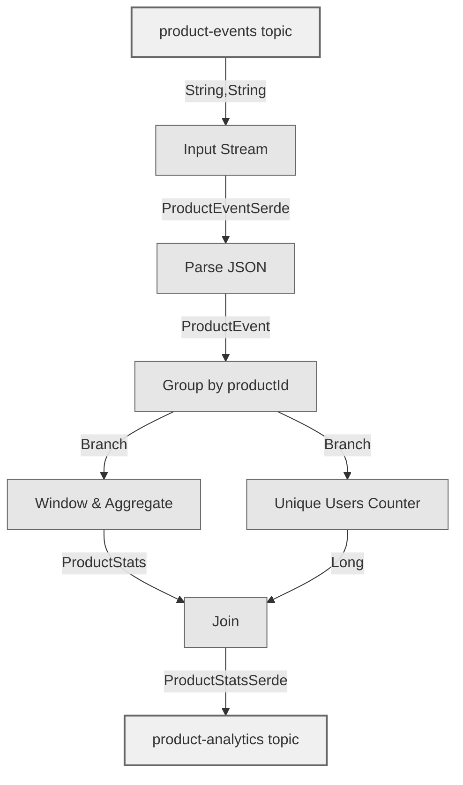
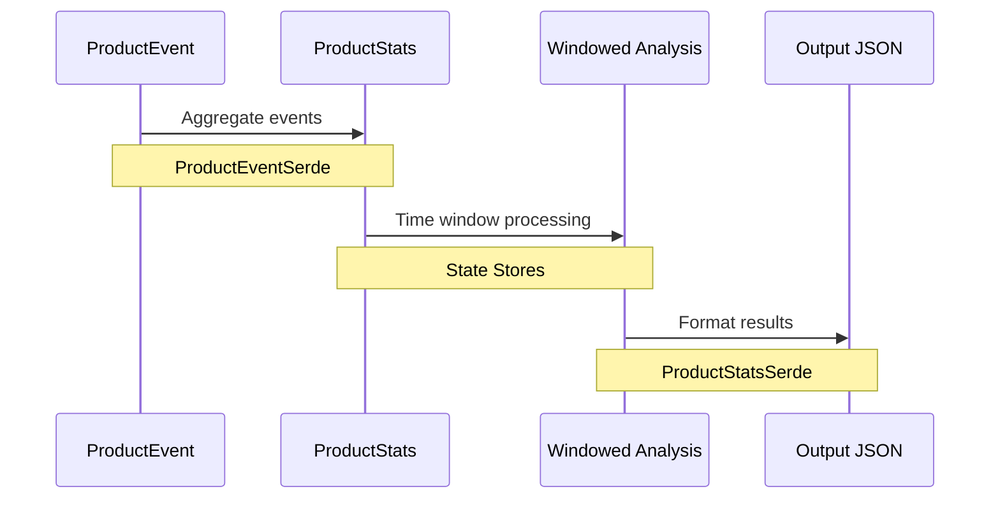
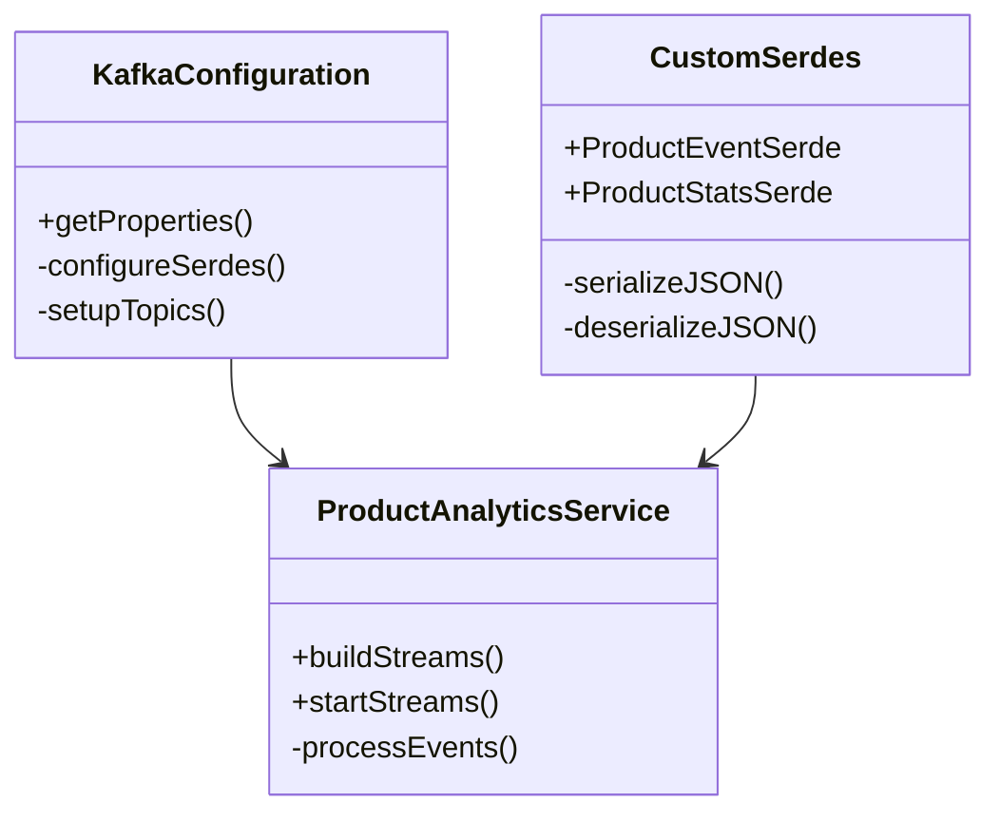

# Architecture Overview

## System Architecture

From an architectural perspective, this system operates in several distinct layers:

### 1. Data Ingestion Layer
- **User Interaction Events**
  - Source: Web/Mobile Applications
  - Capture Method: Real-time event streaming
  - Volume: Millions of events per hour
  - Data: Views, clicks, purchases

- **Product Catalog Updates**
  - Source: Product Management System
  - Capture Method: Change Data Capture (CDC)
  - Frequency: Multiple times per day
  - Data: Product details, pricing, categories

### 2. Stream Processing Layer
- **Event Enrichment**
  - Join events with product metadata
  - Validate and standardize data formats
  - Filter invalid or duplicate events

- **State Management**
  - Maintain windowed aggregations
  - Track unique user counts
  - Handle out-of-order events
  - Manage distributed state stores

### 3. Analytics Processing Layer
- **Time-Window Processing**
  - 5-minute tumbling windows
  - 1-minute sliding windows for trends
  - Parallel processing across partitions

- **Aggregation Engine**
  - Group by product and category
  - Calculate running statistics
  - Maintain materialized views

### 4. Output Layer
- **Real-time Analytics**
  - Push to analytics topic
  - Update monitoring dashboards
  - Trigger alerts on thresholds

- **Data Persistence**
  - Changelog topics for recovery
  - Compacted topics for current state
  - Backup state stores

## Data Flow Diagrams

### Processing Pipeline


### Component Interaction


## System Components

### Core Components


## State Management

### RocksDB Integration
This application uses RocksDB for state management:

- **Window Aggregations**
  - Stores time-windowed statistics
  - Manages unique user counts
  - Handles join operations

- **Configuration**
  ```java
  Materialized.<String, ProductStats, WindowStore<Bytes, byte[]>>
      as("product-stats-store")
  ```

### State Stores
- Changelog topics for recovery
- Local state for fast access
- Distributed state management

## Performance Characteristics

- **Throughput**: 100k+ events/second per node
- **Latency**: < 100ms end-to-end processing
- **Recovery Time**: < 30 seconds after node failure
- **Memory Usage**: Configurable with cache settings

## Scalability Considerations

### 1. Horizontal Scaling
- Partition-based distribution
- Stateful processing with local storage
- Automatic work rebalancing

### 2. Fault Tolerance
- Exactly-once processing
- Automatic recovery
- State store backups

### 3. Resource Management
- Configurable cache sizes
- Memory-efficient processing
- Optimized state access

## Next Steps

- See the [Getting Started Guide](getting-started.md) for setup instructions
- Check [Monitoring](monitoring.md) for operational details
- Review [Troubleshooting](troubleshooting.md) for common issues 